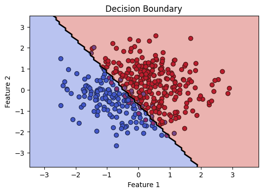
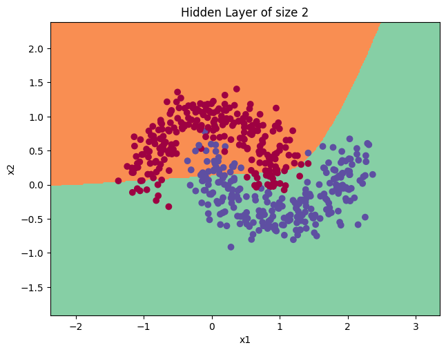
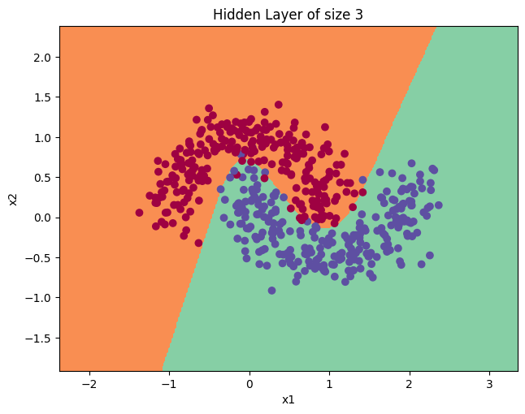
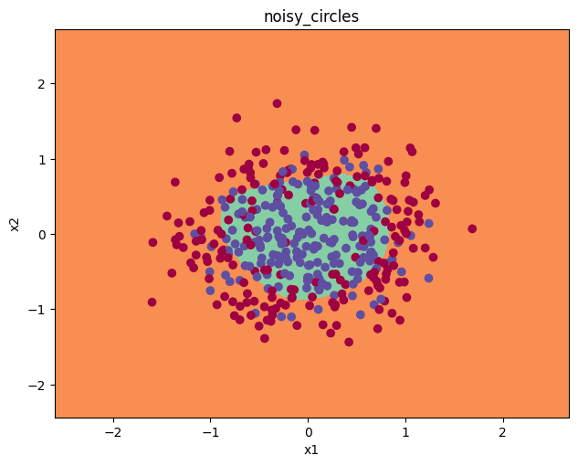
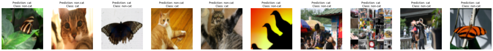
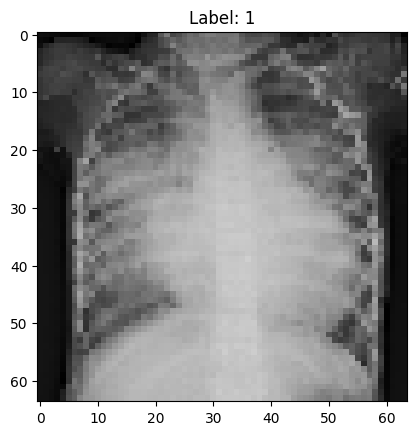

# Implementing Neural Networks with Numpy from scratch

Folders:
## Logistic Regression
- folder: ```basics```
- The math behind a sigle unit of Logistic Regression is beuatifully implemented using numpy. 
- The intricacies of initializing weights and biases, forward and backward propagation, computing gradients, and updating weights and biases are implemented.
- The code is tested on various sythetic datasets and on the cat vs non cat dataset. Decision boundary and learning curves are plotted for better understanding.


## Shallow Neural Networks 
- folder: ```shallow_nn```
- Neural Network using 1 hidden layer is implemented from scratch including forward and backward propagation, computing gradients, updating weights and biases.
- The number of hidden units used can be changed and the resulting model is testing on the noisy moon dataset.




## Deep Neural Networks
- folder: ```deep_nn```
- l_layer_nn is implemented from scratch. The architecture of the neural network can be provided as input and the model is trained using the given dataset.
- The intricacies of computing cost, gradients of linear and activation functions, updating weights and biases are implemented.
- This implementation is tested on the synthetic dataset and the cat vs non cat dataset. It achives a very good accuracy compared to the shallow neural network.


## Improving Deep Neural Networks
- folder: ```improving_nn```
- improved_nn incorporates various techniques to improve the performance of the neural network such as:
    - Initialization: He initialization, Random initialization, Zero initialization
    - Regularization: L2 regularization, Dropout (In progress)
    - Optimization: Mini-batch gradient descent, Momentum, Adam, RMSprop (In progress)


## Diagnosis of Pneumonia using Deep Neural Networks trained on Chest X-ray images
- folder: ```application```
- The l_layer_nn is trained on the chest x-ray images to diagnose pneumonia.
- The current model gives very less accuracy.
- The improved neural network techniques are being implemented to improve the accuracy of the model. (In progress)